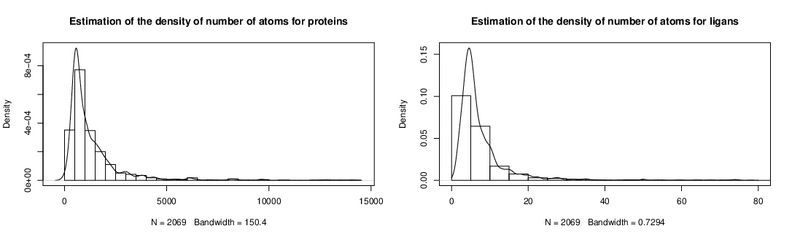

# CS5242 Project : Predicting Protein – Ligand Interaction by using Deep Learning Models

## Description of the project

**See [project_description.pdf](./project_description.pdf) for the full description of the project **

### Data Sets given — Notation and formalisation

An example is a pair of a protein and its associated ligand.

For an example numebered `xxxx`, each molecules of the pair is represented in a file:

-  `xxxx_pro_cg_.pdb` for the protein
-  `xxxx_lig_cg_.pdb` for the ligand

There is a **one-to-one association between proteins and ligands** ie: 

​			`xxxx_lig_cg_.pdb` **cannot bind** `xxxx_pro_cg_.pdb`

Each of those files contains information about the atom of the molecules ; for each atom there is **4 features**

- $(x,y,z) \in \mathbb{R}^3$ : its position in 3D
-  $type \in \{hydrophobic, polar \}$

**See comments bellow about "*Data and training*" for an overwiew of data** 

### Goal and evaluation

Find, for a each protein, *the* ligand that binds it.

This is a hard problem, thus the evaluation is eased:

​	For each new protein, find 10 ligens that could fit in the protein.

If one on the match is in the set of the 10 ligens: the answer is considered good  !

The final score is proportional to the total number of match for proteins.

### Some related questions or ideas to experiment

###### Rotations of proteins: 

- Would performing 3D rotations be usefull to have more examples ? 
- It is possible to find a canonical representation for molecules ? I.E for a given protein in a random position, is it possible to find a "natural" position of this same protein easily for every random position ?
  - It should be possible using PCA on the system of protein and ligand, yes!

###### Proteins and their atoms:

- Is there a specific fixed number of atoms for each protein?
  -  No : molecules do have differents number of atoms (see bellow). Generally, proteins have much more atoms than ligands.
- Why considering only 2 types of atoms (*hydrophobic* and *polar*) instead of the 3 first types (*C*, *O* and *N*) ?

###### Data and training

- Where is the data coming from? What are the other features present in the files?
  - It should be coming from the popular [PDBBind](http://www.pdbbind.org.cn/) data base.
- For now, we have $n=3000$ examples (pair of protein and ligens). But if we see the problem as a classification problem from a couple protein/ligen to a prediction fit / not fit, we can construct loads of differents examples. More expecially, we can for each example construct $n-1$ other examples. Those examples won't represent a protein-ligand system, but can be used as example for the "not-fit" class. Hence we could have in total $3000 \times 2999 = 8\ 997\ 000$ examples
- **Bigest problem for now:** the number of atoms is extremely variant for the molecules. See [`info`](./info) .

```
# Number of atoms for proteins and ligands
	pro             lig         
 Min.   :    0   Min.   :  1.000  
 1st Qu.:  546   1st Qu.:  4.000  
 Median :  854   Median :  5.000  
 Mean   : 1343   Mean   :  8.502  
 3rd Qu.: 1577   3rd Qu.:  9.000  
 Max.   :14102   Max.   :300.000 
```



We need to find a way to resolve this problem. There are [several approaches](https://ai.stackexchange.com/questions/2008/how-can-neural-networks-deal-with-varying-input-sizes):

> - Zero padding. 
> - [RNNs](https://en.wikipedia.org/wiki/Recurrent_neural_network)
> - Another possibility is using [recursive NNs](https://en.wikipedia.org/wiki/Recursive_neural_network).


- A (naîve ?) but working solution is to discretize the space containing the protein-ligand system and then represented on each little cube the information of atom. For a given cube, if there is no atom, then, the information is nulled. This approach is used in different models (such as AtomNet and Pafnucy).

  ​

###### Curious observations about the data set   

- Some files do not contain atoms, the molecules are empty, even for some proteins.
  - We should identify wich are those files exactly and then think about how we could handle those missing examples

###### Some others thoughts

- When we are going to test, the approach would be to return the ligands with the highest probability. However, we know that there is an extra constraint on atom, more precisely that there is a one to one correspondance. Hence, we *should or must* take decisions for ligands generally and not per case as we could choose several ligands for several protein with an high confidence. If we are given $n_p$ proteins and $n_l$ ligands to test :
  - The first (naiver) approach would consist to evaluate the $n_l$ ligands and take the 10 best ones.
  - The second approach would consist to evaluate the $n_p\times n_l$ systems and then take, for each ligands that are chosen several times, the associated protein of highest confidence.


## Things to do

- [ ] Do some research on proteins-ligands binding
- [ ] Find appropriate computing ressources
      - [ ] AWS
      - [ ] Google Cloud
      - [ ] NUS Clusters
      - [ ] [NSCC](https://help.nscc.sg/)
- [ ] Create final pipeline to test binding (as what's required)
      - [ ] Use better metrics (Confusion Matrix, F1 Score, ROC)


- [ ] Find a way to balance scores
- [ ] Find goods numbers to scores

## Organisation of the pipeline and of the files

In order to fit the model with the given data, some transformation need to be performed. Those transformation composed a pipeline that can be deconstructed in several stage. The first part of the pipeline is done in scripts wherease latter parts of the pipeline (training and testing) is done in the [`pipeline.ipynb`](./src/pipeline.ipynb) notebook for more interactivity (and to avoid forgetting to save a network after having it trained 🙃).

- **Extraction of data** : the extraction of features of interest from the "raw data";	
  - Original data in [`training_data/orignal`](./training_data/original) will be extracted in [`training_data/extracted/`](./training_data/extracted) ;
  - Data extracted are into $7$ features:
    - coordinates $(x,y,z) \in \mathbb{R}^3$
    - type of atom (represented one $2$ features as it is one-hot encoded)
    - type of molecules (represented one $2$ features as it is one-hot encoded)
  - The naming convention here is kept from the original data:
    - `original/xxxx_lig_clg.pdb` will be extracted into `extracted/xxxx_lig_clg.csv`
    -  `original/yyyy_pro_clg.pdb` will be extracted into `extracted/yyyy_pro_clg.csv`
  - This stage is perform in  [`extraction_data.py`](./src/extraction_data.py)


- **Creating training examples**  (for now, $90/10$ is used)
  - An **example** consist of the concatenation of the extracted file of a protein (let's say`extracted/xxxx_lig_clg.csv`) and of a ligand (let's say `extracted/yyyy_lig_clg.csv`)
  - We have to splitting the data into 2 sets for training and testing purposes : 
    - **Training set**: creation of training examples: *all* the positives examples and *some* negatives examples) from $90\%$ of the extracted data ;
    - **Testing set** : creation of *all* the examples from $10\%$ of the extracted data
    - *Only the training set gets created* (as the testing set is enormous as we are considering all the possible combinations!)
    - `settings.py/split_index` indicates what is the last training example and what is the first testing example 
  - Training examples are saved in `training_data/training_examples` under the naming convention `xxxx_yyyy.csv` (where `xxxx` is the id of the protein and `yyyy` the ligand's).
  - This stage is perform in   [`create_training_examples.py`](./src/create_training_examples.py)
- **Training of the model with constructed examples**
  - Examples from the Training set (`training_data/training_examples`) are fed in the network directly.
    - They have to be converted into cubes for now (see "Cube Creation" bellow for more info).
  - This stage is done in [`pipeline.ipynb`](./src/pipeline.ipynb) 
- **[TODO] Saving the network to memory**
  - This stage has to be perform to save the model that just have been learned
  - This would alow us to compare and use them afterwards
  - This stage has to be done in [`pipeline.ipynb`](./src/pipeline.ipynb) 
- **[TODO/ to complete] Evaluation of the model **
  - Testing examples are constructed on the go (see "Cube Creation" bellow);
  - They consist of all the combinations possibles on the extracted remaining data (after split index)
    - Let's say we have 10 total original pairs of files (of indices from 0 to 9). If `split_index` is 6, we have the following index for the training and the testing dataset:
      - Training : (0,1,2,3,4,5)
      - Testing : (6,7,8,9)
    - As all the combinations of protein ligand are constructed we have at the end the following testing examples:
      - (6_6), (6_7), (6_8), (6_9), 
      - (7_6), (7_7), (7_8), (7_9)
      - (8_6), (8_7), (8_8), (8_9)
      - (9_6), (9_7), (9_8), (9_9)
        - where (6_6), (7_7), (8_8) and (9_9) are possitive example and all the others are negative
    - This stage has to be done in [`pipeline.ipynb`](./src/pipeline.ipynb) 
  - Some notes: accuracy is now used I thin, but it would be better to use a confusion matrix (as there might be a lot of false negatives)


### Cube creation

In order to fed examples (that are a  rotein-ligand system with varying number of atoms), we can discretize the space that surrounds this system into a cube whose voxel can contain information about atoms if any (like in Pufnacy — see the paper).

Hence, cubes, given a `resolution`, can be deconstructed in `resolution^3` voxels. Each voxel can contain 4 information namely the one-hot encoding of the atom and molecule types. Thus a cube can be represented as a tensor of shape `(resolution, resolution, resolution, 4)`. On the last axis, the molecule type is presented before the atom type, hence:

- `cube[:, :, :, 0:2]` all the molecules types at each position in the space
-  `cube[:, :, :, 2:4]` all the atom types at each position in the space
- `cube[42,42,42]` : all the information about the voxel in the 43rd position in every axes

The discretization was first "schrinking/squashing/flattening" long molecule ; this is now resolved to be scale invariant but this first behavior can be trigerred.

Also, the system is rotation to reach a representation invariance on the protein (using some bits of internals of PCA). This can be deactivate using an argument. 

This transformation that is used both for training and testing is done in [`discretization.py`](./src/discretization.py).


## Some resources

- [Protein on Wikipedia](https://en.wikipedia.org/wiki/Protein)
- [Protein Structure on Wikipedia](https://en.wikipedia.org/wiki/Protein_structure)
- [Drug Design on Wikipedia](https://en.wikipedia.org/wiki/Drug_design)
- [Format of `pdb` files](ftp://ftp.wwpdb.org/pub/pdb/doc/format_descriptions/Format_v33_A4.pdf)
- [Download PyMol](https://pymol.org/2/#download)
- [Doc of PyMol](http://pymol.sourceforge.net/newman/userman.pdf)
- [Keras Documentation - Sequence Model](https://keras.io/getting-started/sequential-model-guide/)
- [PDBBind](http://www.pdbbind.org.cn/)