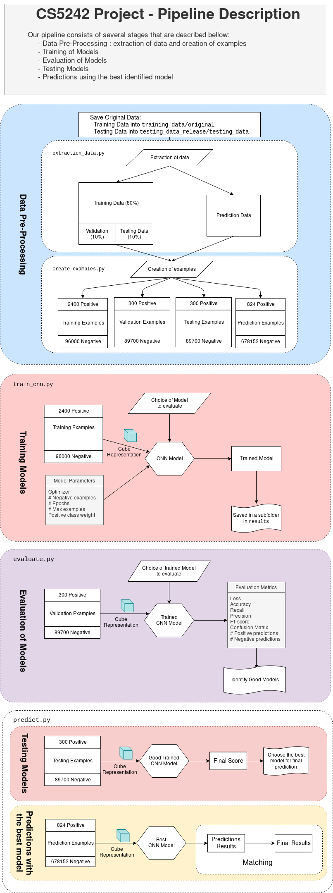

# CS5242 Project : Predicting Protein – Ligand Interaction by using Deep Learning Models

## About this project

This is a term project for the module CS5242 (Deep Learning and Neural Networks). It has been realized by Wang Jun and Julien Jerphanion. The project description is accessible [here](./documentation/project_description.pdf).

The repository is publicly accessible [here](https://github.com/jjerphan/CS5242Project/) and we recommend reading this document online for a better readability.

#### Organisation of this document:

- Really Quick Start Reference
- Detailed usage of the project
- Using jobs of the pipeline without the cluster
- Pipeline Diagram
- Structure of the project
- Structure of the code base : `code`
- About the license

## Really Quick Start Reference 

**This guide assumes the program will be running on NSCC GPU cluster.** The steps presented here might need some modification if you want to run it on other GPU resources (see "Using jobs of the pipeline without the cluster" section).

This really quick start guide includes the full cycle of preparing data, training, evaluation and prediction of protein/ligand binding. If you want more guidance, read the "Detailed usage of the project" section.

##### 1. Copy project code into conda environment. Install required packages (refer Usage section).

```bash
# Install the complete Anaconda distribution
$ git clone https://github.com/jjerphan/CS5242Project/
$ cd CS5242Project # {project folder}
$ conda env create -f environment.yml # for small tasks
$ conda env create -f environment_gpu.yml # for jobs (computational intensive tasks)
$ source activate CS5242
```

##### 2. Create soft link for training and testing data folder due to limited harddisk space. 

```bash
$ mkdir /scratch/users/nus/{student id}/training_data
$ mkdir /scratch/users/nus/{student id}/testing_data_release
$ cd CS5242Project # {project folder}
$ ln -s /scratch/users/nus/{student id}/training_data training_data
$ ln -s /scratch/users/nus/{student id}/testing_data_release testing_data_release
```

##### 3. Save training data to training folder. Copy testing_data_release.zip to project root folder and unzip the files. 

```bash
$ unzip training_data.zip
$ mv training_data training_data/original
$ unzip testing_data_release.zip
```

##### 4. Run full pre-processing pipeline 

````bash
(CS5242) $ python code/extraction_data.py
(CS5242) $ python code/create_examples.py # create protein/ligand complexes. (Note: This may takes a while depending on the compute resources as +150 Gb of data are created)
````

##### 5. (Optional) Train or best model new model. 

Just run:

```bash
(CS5242) $ qsub train_best_model.pbs
```

Results and informations about the model will be stored in `results/xxxxxxx.wlm01/`. Where `xxxxxxx` is a number of 7 digits.

##### 6. (Optional) Evaluate the model using validation dataset. 

```bash
(CS5242) $ python code/create_job_sub.py
```

Choose 2  for evaluating the trained model, then choose the model to use for evaluation.

Then submit the job:

```bash
(CS5242) $ qsub jobs_submissions/<the file created>.pbs
```

Evaluation metrics results of the model will be stored in `results/evaluation/evaluation.csv`.

##### 7. Predicting testing data release.

```bash
(CS5242) $ python code/create_job_sub.py
```

Choose 4 for prediction, then **enter any character to predict** then choose the model to use for prediction. 

Then submit the job:

```bash
(CS5242) $ qsub jobs_submissions/<the file created>.pbs
```

The final prediction (best ligands for protein) are stored in `results/xxxxxxx.wlm01/xxxxxxx.wlm01_final_prediction.txt`.

## Detailed usage of the project

The workflows in composed of several stages: 

- **Downloading the data**: 
  - done via `scp`
- **Installation of the environment** 
- **Creating the environnement** 


- **Extraction of data** and assignements of pair of molecules to the `training`, `validation`, `testing` and `predict` data sets
  - Locally on the cluster 
- **Creation of examples for each data set**
  - Locally on the cluster
- **Training a model:**
  - As a job on the cluster
- **Evaluating one or several model**
  - As a job on the cluster
- **Testing or predicting one model**
  - As a job on the cluster
- **Downloading results of training and evaluation**
  - Locally on the cluster

### Downloading the data and putting it in the right folder

Before running anything, you need to place the original data in the `training_data/original` folder and to put the data for prediction in `testing_data_release/original`.

We recommend using `scp` to upload the files on the server instead as it is faster than directly downloading the data set on the server.

### Installation of the environments

We use Anaconda as well as two environments for this project as some operations can be performed locally on the cluster and as some others need computational powers to be executed.

You can create such environments with the following command:

```bash
conda env create -f environment.yml # CPU env. for small tasks or debugging
conda env create -f environment_gpu.yml # GPU env. for jobs (computational intensive tasks)
```

Then, you can activate one environment like this:

```bash
source activate CS5242
source activate CS5242_gpu
```

To exit one environment:

```bash
source deactivate
```

All the following operations are performed:

- using the `CS5242` environment if they get run locally on the cluster and don't need (*you need to activate it first*)
- using the `CS5242_gpu` environment if run as a job on the cluster (the environement is activated automatically when running it)

*Hence, when you are in a session on the cluster, we recommand to directly activate the  `CS5242` environement directly.*

### Extraction of data

To extract the data you have to run:

```bash
(CS5242) $ python code/extract_data.py
```

The data will be extracted in the `training_data/extracted/train/`, `training_data/extracted/validation/`, `training_data/extracted/test`  for the original data and in `testing_data_release/extracted`for the data used for prediction

### Creation of examples

#### ⚠ BE CAREFUL : for this step, a lot of data will be created (with the default settings, more than 150Gb). By default, all the examples for validation, testing and prediction are created. If you want to create less data, we recommend using the `nb_neg` argument for the creation of examples (see the tail of `code/create_examples.py`)

To extract the data you have to run:

```bash
(CS5242) $ python code/create_examples.py
```

Examples will be populated in the `training_data/training_examples/`, `training_data/validation_examples/`, `training_data/test_examples` for the original data and in `testing_data_release/predict_examples`for the data used for final predictions.

### Training a model

Training a model is done as a job on the cluster. To do this, you have to `qsub` a submission file. We provide a way to create such a file with  `code/create_job_sub.py`.

```bash
(CS5242) $ python code/create_job_sub.py
```

Then choose `create_train_job` and enter the parameters than you want to use to train your model.

At the end, your file (let's call it `train_cnn_model_some_parameters.pbs`) will be create in `job_submissions`. 

To run the job, you have to submit the file:

``` bash
(CS5242) $ qsub job_submissions/train_cnn_model_some_parameters.pbs
```

An ID of the jobs (let's say `xxxxxxx.wlm01`) is returned. Results of this job are saved in  `results/xxxxxxx.wlm01`; those results include:

- `xxxxxxx.wlm01_history.pickle` : the `history` dictionarry of the `History`  object return by `model.fit`
- `xxxxxxx.wlm01_train_cnn.log`: the logs of the training procedure
- `xxxxxxx.wlm01_model.h5`: the serialized model
- `xxxxxxx.wlm01_parameters.txt`: the set of parameters used to train the model

Note that you can submit those type of jobs as much as you want.

### Evaluating one model or all the models

You can evaluate a model using the pipeline given before:

```bash	
(CS5242) $ python code/create_job_sub.py
```

Then select `create_evaluation_job`, select the model associated to a job (for instance`xxxxxxx.wlm01`) you want to evaluate, and then the parameters used for the evaluation.

At the end, your file named`evaluate_xxxxxxx.wlm01.pbs` will be created in `job_submissions`. 

To run the job, you have to submit the file:

```bash
(CS5242) $ qsub job_submissions/evaluate_xxxxxxx.wlm01.pbs
```

The result of the evaluation of one model is a log `evaluate_xxxxxxx.wlm01.log`  that is saved in the same`results/xxxxxxx.wlm01` folder.

A log is appended to `evaluation/evaluation.csv`: the final result of the evaluation.
It contains for each model, values of the metrics as well as the parameters used for the training.

### Testing or predicting one model

You can evaluate a model using the pipeline given before:

```bash	
(CS5242) $ python code/create_job_sub.py
```

Then select `create_predict_job`, select the model associated to a job (for instance`xxxxxxx.wlm01`) you want to test or predict with, and then the parameters used for the evaluation.

At the end, your file named`evaluate_xxxxxxx.wlm01.pbs` will be created in `job_submissions`. 

To run the job, you have to submit the file:

```bash
(CS5242) $ qsub job_submissions/evaluate_xxxxxxx.wlm01.pbs
```

You can also choose to create mutliple files to evaluate models that have been trained but not evaluated yet.

The result of the evaluation of one model is a log ``evaluate_xxxxxxx.wlm01.log`  that is saved in the same`results/xxxxxxx.wlm01` folder.

### Downloading the results of training and evaluation on the clusters and inspecting them

Sometimes, it is easier to inspect the results of training and evaluation on one's local machine.

We have written a little script to compress all the results of jobs (except serialized models, i.e. `*model.h5` files) in an archive. The structure of the folder will be the same.

To compress all your results simply run:

```bash	
chmod +x compress_results # to make it executable
./compress_results
```

A `timestamp_exported_results.tar.gz` will be created. You can download this file on you machine using `scp`.

You can then inspect those results locally. Just place the extracted `results` folder at the root of the project locally and run  `code/plot_training.py`.

## Using jobs of the pipeline without the cluster

If you would like to train, evaluate and predict on another machine, you can just execute submissions file on your machine like so for example.

```bash
(CS5242) chmod +x ./job_submissions/train_cnn_model_some_parameters.pgb
(CS5242) bash ./job_submissions/train_cnn_model_some_parameters.pgb
```

Alternatively, you can execute job directly running

```bash
(CS5242_gpu) $ python code/train_cnn.py --some options
(CS5242_gpu) $ python code/evaluate.py --some options
(CS5242_gpu) $ python code/predict.py --some options
```

With specified option. See the content of submissions files and of those `.py` for more guidance.

## Pipeline Diagram




## Structure of the project

The project is organised as follows:

| File or folder        | Role                                                |
| --------------------- | --------------------------------------------------- |
| `code/`               | Our code base (detailed in the section bellow).     |
| `README.md`           | This file.                                          |
| `documentation/`      | A folder holding diverse elements of documentation. |
| `environment.yml`     | Anaconda CPU environnement (used for installation). |
| `environment_gpu.yml` | Anaconda GPU environnement (used for installation)  |
| `._travis.yml`        | For running tests remotely (in standby for now)     |
| `LICENSE`             | The License file of this project                    |
| `compress_results.sh` | A script to extract results.                        |
| `test/`               | Tests of the code base.                             |

## Structure of the code base : `code`

The code base is organised as follows: 

| FIle                   | Role                                                         |
| ---------------------- | ------------------------------------------------------------ |
| `settings.py`          | All the settings used for the project.                       |
| `models.py`            | File containing the models developped.                       |
| `examples_iterator.py` | A class to iterate through examples (used around in the project<br />to handle example from the different dataset). |
| `pipeline_fixtures.py` | Some small helpers functions that are used several time in the pipeline. |
| `create_job_sub.py`    | Used for the job submission for the NSCC cluster.            |
| `models_inspector.py`  | A class to iterate on serialized model.                      |
| `extraction_data.py`   | Set of functions to extract the original data and construct new data set of useful features. |
| `create_examples.py`   | Set of functions to create positives and negatives examples. |
| `discretization.py`    | Set of functions dedicated to the creation of 3D representations for examples |
| `evaluate.py`          | A job to evaluate a given serialized model                   |
| `train_cnn.py`         | A job to evaluate a given specified model                    |
| `predict.py`           | A job to test or predict final result using a given serialized model |
| `predict_generator.py` | A generator that iterates through examples for predictions   |
| `plot_training.py`     | A script to plot result obtained during training             |

## About the license

This project is accessible under GPL-3.0.